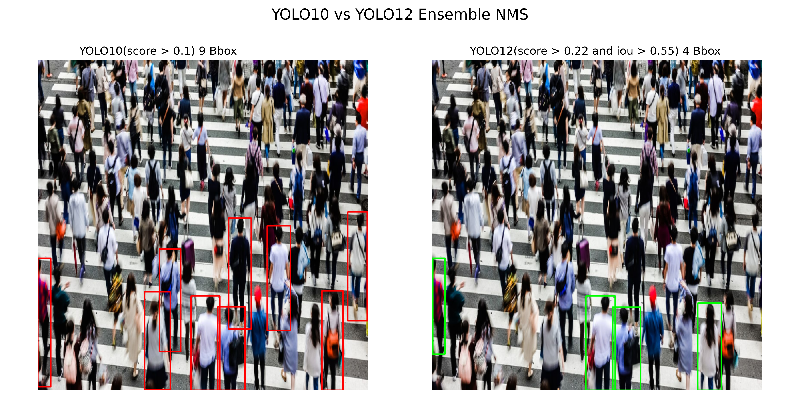

[`TensorRT(YOLO10)`](raw_yolo10_engine.py) **FPS: 69.95**\
[`TensorRT(YOLO12)`](raw_yolo12_engine.py) **FPS: 49.04**\
[`TensorRT(YOLO12_NMS)`](yolo12_nms_engine.py) **FPS: 32.98**\
[`TensorRT(YOLO12)+CPU(NMS)`](yolo12_engine_nms_cpu.py) **FPS: 43.66**\
[`TensorRT(YOLO10+YOLO12_NMS)`](yolo10_yolo12NMS_bbox.py) **FPS: 18.61**

*ONNX model birleştirme işlemleri [Ensemble_Models](https://github.com/mevlt01001/YOLO12-RTDETR-ensemble-model) reposuna eklenmiştir.*

