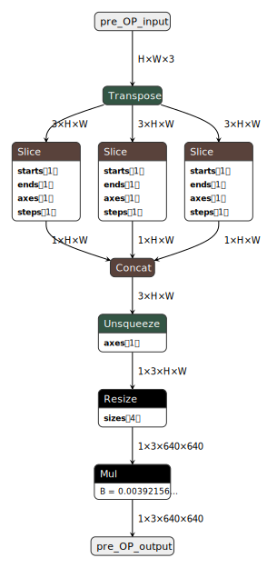
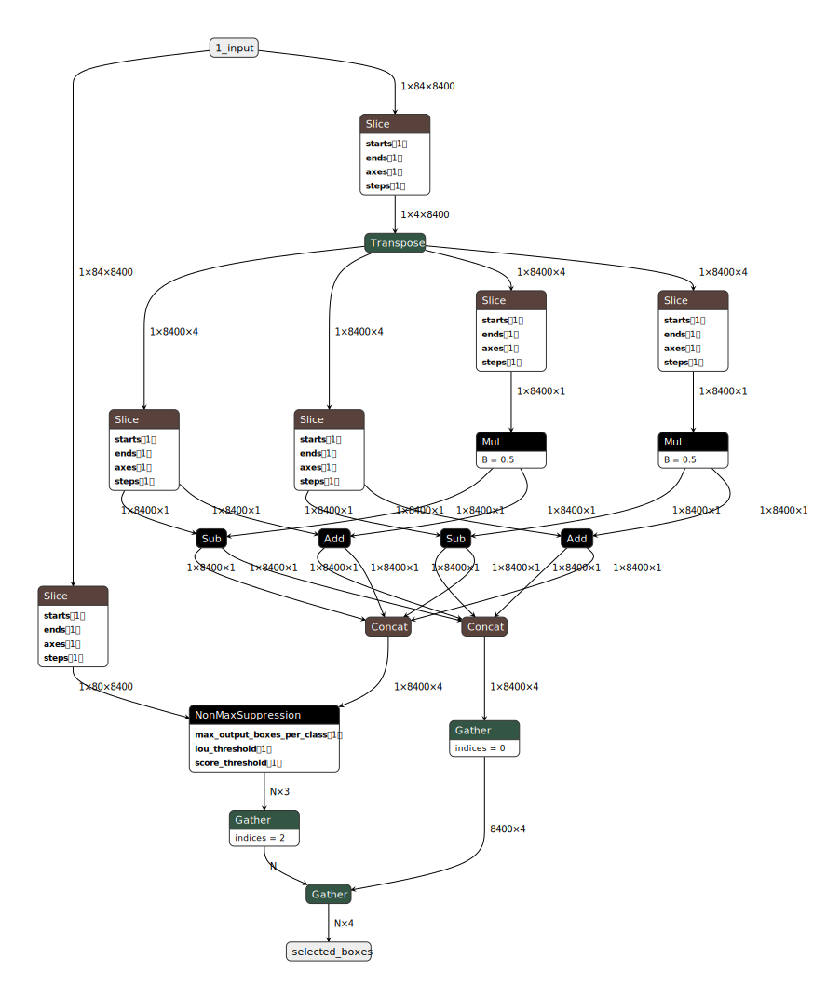

ONNX formatına çevrilmiş [preprocess](create_onnx_preprocess.py) ve [postprocess](create_onnx_postprocess.py) katmanlarını; **Jetson AGX Orin** için ONNXRuntime(CPU,GPU) ve TensorRT FP16 optimizasyonlu formatlarda **YOLOv9c** ile birlikte gecikmelerini hesaplanır.

*PINTO0309 WhloBody28-refine çalışmasından dolayı **YOLOv9c** esas alındı.*

*[load YOLOv9c.onnx](https://drive.google.com/drive/folders/1Y4fIZ2RIcwwvMGylCMhVJTgsWY8OH8LE?usp=drive_link)*

[create_onnx_preprocess.py](create_onnx_preprocess.py) ONNX formatında preprocess layer oluşturur.\
[create_onnx_postprocess.py](create_onnx_postprocess.py) ONNX formatında postprocess layer oluşturur.\
[make_yolo_pre_post_onnx.py](make_yolo_pre_post_onnx.py) ONNX formatında preprocess+YOLO, YOLO+postprocess ve preprocess+YOLO+postprocess şeklinde 3 model oluşturur.\
[onnx2engine.py](onnx2engine.py) ONNX dosyasını TensorRT kuallanarak optimize eder ve engine dosyasına dönüştürerek kaydeder.\
[measure_latencies.py](measure_latencies.py) Belirlenen formatlarda FPS ve Gecikme ölçümü yapar.

## FPS Sonuçları

| Pre-process | YOLO (TRT) | Post-process | FPS YOLOv9c  | FPS YOLOv11m  |
| ----------- | ---------- | ------------ | ------------ | ------------- |
| CPU         | TRT        | CPU          | **23.14**    | **25.40**     |
| CPU         | TRT        | GPU          | **16.54**    | **17.85**     |
| CPU         | TRT        | TRT          | **23.36**    | **25.65**     |
| GPU         | TRT        | CPU          | **42.76**    | **52.16**     |
| GPU         | TRT        | GPU          | **26.71**    | **27.67**     |
| GPU         | TRT        | TRT          | **44.45**    | **55.54**     |
| TRT         | TRT        | CPU          | **58.14**    | **60.12**     |
| TRT         | TRT        | GPU          | **29.65**    | **31.16**     |
| TRT         | TRT        | TRT          | **64.12**    | **66.17**     |

> CPU: ONNXRuntime CPUProvider\
> GPU: ONNXRuntime CUDAProvider\
> TRT: TensorRT Runtime
---

## İşlem Gecikmeleri (ms)

| İşlem                    | CPU   | GPU   | TRT    |
|--------------------------|-------|-------|--------|
| Pre-process              | 33.28 | 6.05  | 3.73   |
| YOLOv9c                  | 475   | 70.76 | 20.29  |
| Post-process             | 2.13  | 33.43 | 10.32  |
| Post-process (cv2.dnn)   | 18.91 |   -   |   -    |

> (cv2.dnn): [measure_latencies.py](measure_latencies.py) dosyasonda *only_cv2_dnn_NMSBoxes_latency* adında fonksiyon.

### Preprocess ONNX

### Postprocess ONNX

