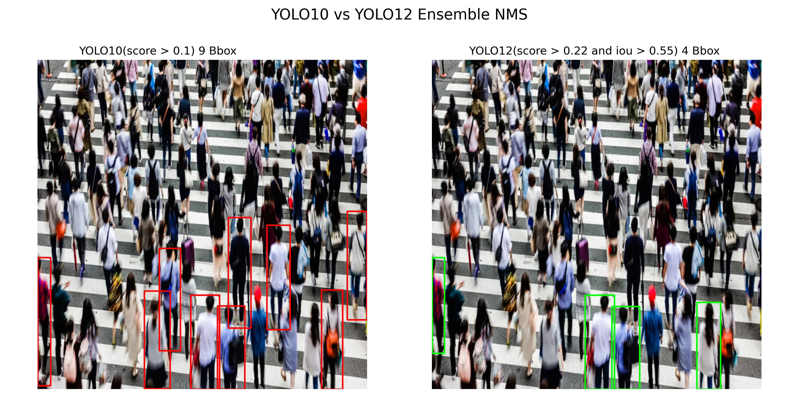

## DESKTOP Results:
[`TensorRT(YOLO10)`](raw_yolo10_engine.py) **FPS: 69.95**\
[`TensorRT(YOLO12)`](raw_yolo12_engine.py) **FPS: 49.04**\
[`TensorRT(YOLO12_TorchvisionNMS)`](yolo12_nms_engine.py) **FPS: 32.98**\
[`TensorRT(YOLO12)+CPU(TorchvisionNMS)`](yolo12_engine_nms_cpu.py) **FPS: 43.66**\
[`TensorRT(YOLO10+YOLO12_TorchvisionNMS)`](yolo10_yolo12NMS_bbox.py) **FPS: 18.61**\
[`TensorRT(TorchvisionNMS)`](only_TorchvisionNMS.py) **FPS: 111.41**\
[`TensorRT(tensorrt.INMSLayer)`](only_INMSLayer.py) **FPS: 1293.98**\
[`TensorRT(tensorrt.INMSLayer_created_onnx)`](only_onnx_nms.py) **FPS: 1382.06**

## AGX ORIN Results:
[`TensorRT(YOLO10)`](raw_yolo10_engine.py) **FPS: 112.39**\
[`TensorRT(YOLO12)`](raw_yolo12_engine.py) **FPS: 38.84**\
[`TensorRT(YOLO12_TorchvisionNMS)`](yolo12_nms_engine.py) **FPS: 24.41**\
[`TensorRT(YOLO12)+CPU(TorchvisionNMS)`](yolo12_engine_nms_cpu.py) **FPS: 33.21**\
[`TensorRT(YOLO10+YOLO12_TorchvisionNMS)`](yolo10_yolo12NMS_bbox.py) **FPS: 20.05**\
[`TensorRT(TorchvisionNMS)`](only_TorchvisionNMS.py) **FPS: None**\
[`TensorRT(tensorrt.INMSLayer)`](only_INMSLayer.py) **FPS: None**
[`TensorRT(tensorrt.INMSLayer_created_onnx)`](only_onnx_nms.py) **FPS: None**

*DESKTOP: GTX 1650 TI Mobile , INTEL I7 10870H*\
*ONNX model birleştirme işlemleri [Ensemble_Models](https://github.com/mevlt01001/YOLO12-RTDETR-ensemble-model) reposuna eklenmiştir.*

## Çıkarımlar
TensorRT destekli NMS işlemleri TensorRT 10.x sürümlerinden önce TRTEfficient_NMS ve BatchedNMS şeklinde mevcut. TensorRT 10.x ile birlikte INetworkDefinition.add_nms() ile NMS eklenebiliyor. Ayrıca onnx.helper.make kullanılarak eklenen NMS nodu TensorRT onnx parseri tarafından INMSLayer'a çevirlebileceğini anlıyor. Bu işlemi Torchvision.ops.nms için yapamıyor.

Her ne kadar TensorRT.INMSLayer [dökümantasyonunda](https://docs.nvidia.com/deeplearning/tensorrt/latest/_static/python-api/infer/Graph/Layers.html#inmslayer) scores ve boxes için shapelerin sırası ile [batchSize, numInputBoundingBoxes, 4] ve [batchSize, numInputBoundingBoxes, numClasses] olması gerektiği söylensede bu format hata veriyor ve çalışan format sırası ile [batchSize, numInputBoundingBoxes, 4] ve [batchSize, numClasses, numInputBoundingBoxes] olması gerekiyor.

TensorRT.NMSLayer çok hızlı çalışsa da IoU thresholdingi her kutu için çok iyi düzeyde yapamıyor ve FP değerini arttırıyor.

[`TensorRT.INMSLayer`](https://docs.nvidia.com/deeplearning/tensorrt/latest/_static/python-api/infer/Graph/Layers.html#inmslayer) 2 farklı yol ile oluşturulabiliyor: [ONNX:helper.make](https://github.com/mevlt01001/YOLO12-RTDETR-ensemble-model/blob/main/INMSLayer_onnx.py) ve [TensorRT:INetworkDefiniton.add_nms](https://github.com/mevlt01001/YOLO12-RTDETR-ensemble-model/blob/main/create_INMSLayer_with_trt.py)

